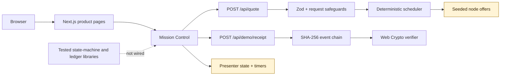

# KairoMesh

**GPU jobs that finish, even when hosts do not.**

KairoMesh is a research-grade vertical slice of an **outcome cloud**: a peer-GPU control plane for bounded, checkpointable batch jobs. Instead of presenting a rented machine and hoping it stays online, the product thesis is to route against an explicit policy, recover an interrupted attempt, validate the declared output contract, and produce inspectable evidence before demo credits settle.

The repository is intentionally honest about its boundary. The product experience, scheduling logic, APIs, state and ledger invariants, receipt chain, and browser verifier work. GPU hosts, workloads, telemetry, checkpoints, evidence, and credits are simulated. This is a serious prototype, not a production compute marketplace.

## What makes the idea different

Most peer-GPU products sell access to hardware. KairoMesh explores selling a **completed, policy-bound outcome**:

- Deterministic placement explains why each synthetic host was selected.
- A failed attempt is fenced before a replacement resumes from a checkpoint.
- A mismatched output quarantines the presenter node and withholds its demo payout.
- A SHA-256 event chain makes a completed run tamper-evident after its root is known.
- Trust is split into explicit evidence tiers instead of collapsed into one misleading "verified" badge.

The current receipt is **not digitally signed, not hardware attestation, and not proof that arbitrary computation occurred or was correct**.

## Run it locally

Prerequisites: Node.js 20.9 or newer. Node.js 24 is the CI and container baseline.

```bash
npm ci
npm run dev
```

Open [http://localhost:3000](http://localhost:3000). No account, GPU, payment method, or environment variable is required for the demonstration.

For canonical sitemap and metadata URLs, copy `.env.example` to `.env.local` and set `NEXT_PUBLIC_SITE_URL` before building.

## The 90-second demo

Open [Mission Control](http://localhost:3000/console), choose a workload, evidence floor, and routing profile, then select **Launch demo run**. When the presenter actions become available after `CHECKPOINT_18`, choose one path:

1. **Continue clean** - output policy checks complete, a seven-block receipt is created and integrity-checked, then the illustrated demo-credit entries settle.
2. **Disconnect host** - the first host loses its heartbeat, the scheduler excludes it, fence `01` becomes `02`, a standby resumes the synthetic checkpoint, and the recovered run seals a nine-block receipt before settling.
3. **Corrupt output** - the sample hash mismatches, the host is quarantined in the presenter, held demo credits return, provider payout remains zero, and the success receipt is withheld.

Successful paths automatically integrity-check the receipt before illustrated settlement. Select **Verify chain in browser** to independently repeat that Web Crypto computation and compare every link with the displayed root hash. Use **Reset** to replay another branch. A longer presenter script and claims guide live in [docs/DEMO.md](docs/DEMO.md).

## Reality ledger

| Status | Capability | Boundary |
|---|---|---|
| Implemented and wired | Responsive product pages and interactive Mission Control | Presenter inventory, metrics, faults, and economics are synthetic. |
| Implemented and wired | `POST /api/quote` with Zod validation, a process-local limiter, and deterministic scheduling | It reads seeded offers; no capacity is reserved. |
| Implemented and wired | `POST /api/demo/receipt` and browser-side Web Crypto verification | The server recomputes the submitted quote policy, derives the selected/failover nodes and amount, then returns a deterministic unsigned chain. |
| Implemented and tested | Versioned job/attempt state machines and monotonic fencing tokens | Domain library only; no database, worker, or API integration. |
| Implemented and tested | Balanced `bigint` demo-credit ledger with idempotency and finalization guards | Domain library only; the UI does not call it and no money moves. |
| Not implemented | Authentication, tenancy, persistent storage, object storage, node agent, sandbox, real execution, attestation, billing, payout, or dispute operations | These are production gates, not hidden features. |

Do not submit untrusted code, customer data, credentials, private model weights, or money to this demonstration.

## Current architecture



For the production target, trust boundaries, lifecycle diagrams, persistence model, and deployment gates, read [docs/ARCHITECTURE.md](docs/ARCHITECTURE.md).

## Product surface

| Route | Purpose |
|---|---|
| `/` | Product thesis, failure visualization, evidence tiers, and receipt story |
| `/console` | Interactive quote, run, failover, mismatch, settlement, and receipt presenter |
| `/architecture` | Visual explanation of scheduler, recovery, and evidence boundaries |
| `/providers` | Honest host economics calculator and provider boundary |
| `/blueprint` | Five-phase startup blueprint from validation through scale |
| `/api/health` | Stateless demonstration liveness response |
| `/api/quote` | Validated synthetic scheduling quote |
| `/api/demo/receipt` | Validated, schedule-bound demonstration receipt chain |

### Quote API example

```bash
curl -sS http://localhost:3000/api/quote \
  -H 'Content-Type: application/json' \
  -d '{
    "id": "demo_job_01",
    "name": "Flood map inference batch",
    "workload": "image-batch",
    "minVramGb": 24,
    "gpuCount": 2,
    "durationMinutes": 30,
    "maxPricePerGpuHour": 1.5,
    "minimumEvidenceTier": "isolated",
    "checkpointIntervalMinutes": 5,
    "priorities": {
      "cost": 0.30,
      "reliability": 0.25,
      "carbon": 0.10,
      "latency": 0.10,
      "trust": 0.25
    }
  }'
```

Successful quote and receipt responses include `simulated: true`. The quote endpoint is non-mutating and does not create a job.

The receipt endpoint accepts `{ scenario, request, failedNodeId? }`. It recomputes the schedule from the bounded quote request; clients cannot choose the receipt’s selected nodes, recovery node, or settlement amount directly. The machine-readable contract is in [`public/openapi.json`](public/openapi.json).

## Quality and security

Run the local quality gate:

```bash
npm run check
```

Run the expanded release checks:

```bash
npm audit --audit-level=moderate
npm run test:coverage
npx playwright install chromium
npm run test:e2e
```

Vitest measures the scheduler, request schemas and bounded body reader, limiter, scenario receipt builder, proof-chain/browser verification, recovery state machine, economics split, and ledger invariants. Playwright covers every responsive route, clean settlement, host failover, output rejection, receipt verification, and automated accessibility checks. CI also runs CodeQL and dependency review.

Verified release snapshot (2026-07-18):

| Gate | Result |
|---|---|
| Unit and API tests | 69 passed |
| Desktop and mobile browser tests | 16 passed |
| Coverage | 93.65% statements, 82.96% branches, 100% functions, 94.5% lines |
| Dependency audit | 0 known vulnerabilities at moderate-or-higher severity |
| Production container | Built and smoke-tested as the non-root `node` user |

The web app configures a restrictive content security policy, frame denial, MIME-sniffing protection, limited browser permissions, response no-store headers for APIs, schema bounds, and request identifiers. These controls do not turn the prototype into a safe workload runner. The complete residual-risk analysis is in [SECURITY.md](SECURITY.md) and [docs/THREAT_MODEL.md](docs/THREAT_MODEL.md).

## Build and deploy the demonstration

```bash
npm run build
npm run start
```

Or run the standalone, non-root container:

```bash
docker build -t kairomesh .
docker run --rm -p 3000:3000 kairomesh
```

For a public HTTPS deployment, bake the canonical URL and TLS-edge policy into the image:

```bash
docker build -t kairomesh \
  --build-arg NEXT_PUBLIC_SITE_URL=https://demo.example.com \
  --build-arg KAIROMESH_TLS_EDGE=true .
```

Set `KAIROMESH_TLS_EDGE=true` only when every request is terminated by a correctly configured HTTPS edge; it enables HSTS and CSP request upgrades. Set `KAIROMESH_TRUST_PROXY=true` at runtime only when a controlled reverse proxy overwrites `X-Forwarded-For`; otherwise the process-local 30/minute quote limit intentionally uses one shared anonymous bucket. The default container remains usable over local HTTP. The current deployment classification must remain **Demo network / synthetic inventory / no live money**. Do not expose a real provider or accept a real requester until every gate in [docs/ARCHITECTURE.md](docs/ARCHITECTURE.md#12-deployment-gates) is satisfied.

## Documentation

- [Product specification](docs/PRODUCT_SPEC.md)
- [Architecture and reality ledger](docs/ARCHITECTURE.md)
- [Threat model](docs/THREAT_MODEL.md)
- [Future node-agent security contract](docs/NODE_AGENT.md)
- [Operations and incident runbook](docs/RUNBOOK.md)
- [Market research](docs/MARKET_RESEARCH.md)
- [Five-phase startup blueprint and 30-day sprint](docs/STARTUP_BLUEPRINT.md)
- [Demo script and claims guide](docs/DEMO.md)
- [Contributing](CONTRIBUTING.md)

## Stack

Next.js 16, React 19, TypeScript, Tailwind CSS 4, Motion, Zod, Vitest, Playwright, and axe-core.

## License

[MIT](LICENSE). Use of the software does not imply that KairoMesh is production-ready or that any future marketplace, payment, confidentiality, or verification claim exists today.
