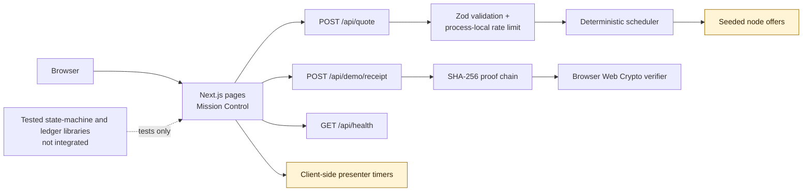
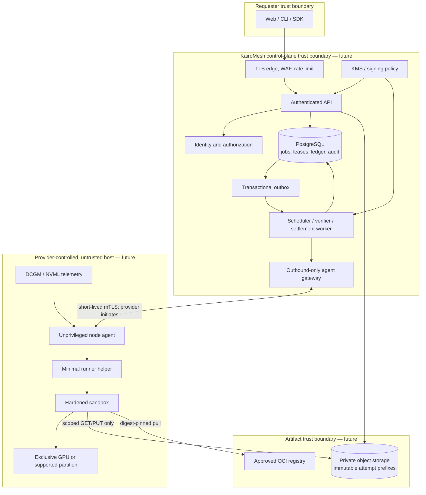
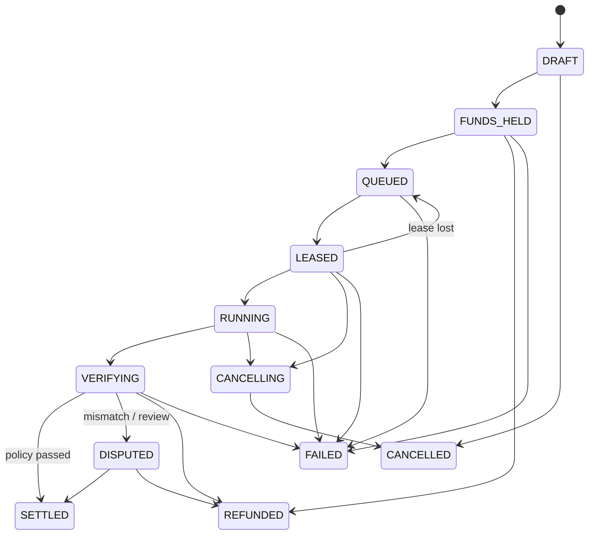
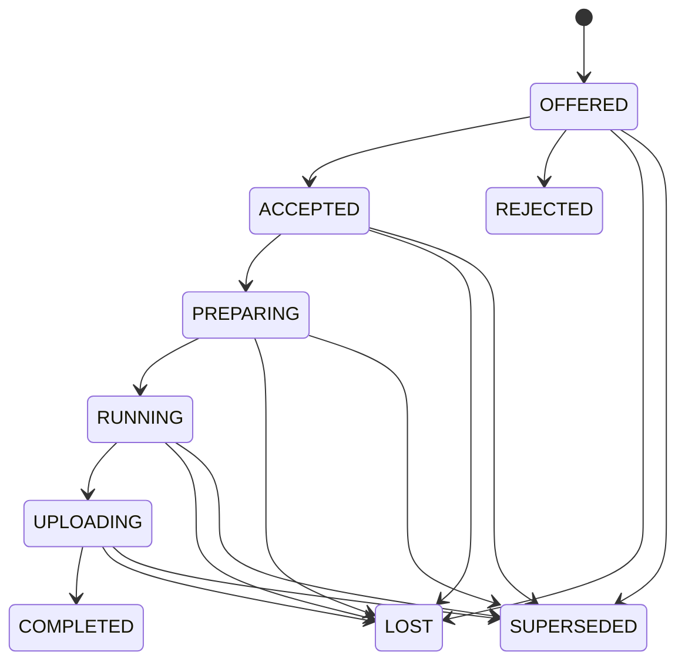

# KairoMesh architecture

**Document status:** design baseline for the `0.1.x` demonstration
**Last reviewed:** 2026-07-17
**System classification:** portfolio/research demonstration; not a production compute marketplace

KairoMesh explores an outcome-oriented peer GPU marketplace for bounded, checkpointable container jobs. The differentiating idea is not remote access to somebody else's computer. It is a control plane that chooses eligible capacity, survives an interruption, validates an output policy, and returns inspectable evidence before demo credits are settled.

This document describes both the code that exists and a production target. Sections and diagrams label future components explicitly. A future component is not an implied feature.

## 1. Reality ledger

### Implemented and wired into the demonstration

| Capability | Implementation | Boundary |
|---|---|---|
| Responsive product and mission-control views | Next.js and React | Inventory, telemetry, failures, checkpoints, and credits are synthetic. |
| Quote API | `POST /api/quote` | Validates a small JSON request and schedules against seeded in-process offers. It does not reserve capacity. |
| Deterministic scheduler | Pure TypeScript hard filters, normalized weighted scoring, diversity bonus, and failover exclusion | Prices, reliability, carbon, evidence, and availability are fixture values. There is no marketplace order book. |
| Receipt-chain API | `POST /api/demo/receipt` | Validates a quote context, recomputes its seeded schedule/failover/amount, and generates a scenario-specific SHA-256 chain. It has no digital signature, external timestamp, or node identity proof. |
| Browser receipt verification | Web Crypto recomputation of every hash link plus comparison with the displayed root | Validates the response's internal chain/root consistency. The root has no signature or external trust anchor. |
| API input safeguards | Content-type checks, streaming 12 KB caps, Zod validation, response hardening, and a bounded in-memory quote limiter | The limiter is process-local. Forwarded client IPs are accepted only when `KAIROMESH_TRUST_PROXY=true`; public deployments still require a trusted edge and distributed controls. |
| Browser security headers | CSP, frame denial, MIME sniffing denial, restricted permissions, and same-origin policies | Deployment configuration and third-party integrations must be reviewed before production. |
| Deterministic presenter paths | Client-side timers for success, disconnect/failover, and output mismatch | No remote host is contacted and no workload runs. |

### Implemented and tested as domain libraries, but not wired into the UI or API

| Capability | Implementation | Boundary |
|---|---|---|
| Job and attempt state machines | Explicit transition graphs, immutable snapshots, optimistic `stateVersion`, and monotonic fencing tokens | There is no durable state store, transaction boundary, worker, or API integration. |
| Demo-credit ledger | `bigint` microcredits, balanced opening/reserve/settle/refund entries, idempotency, finalization guards, and liability audit | The mission-control ledger display is presentation data; it does not call this module. There is no wallet, bank money, payout, or escrow. |

### Not implemented

- User authentication, organizations, tenancy, roles, API keys, or authorization.
- Persistent database, transactional outbox, distributed queue, or background worker.
- Object storage, uploads, checkpoints, encryption, signed URLs, or retention controls.
- A node agent, host enrollment, mTLS, hardware discovery, real heartbeat, or remote execution.
- OCI image pulling, signature verification, vulnerability scanning, sandboxing, GPU isolation, or egress enforcement.
- Node-generated signatures, certificate rotation/revocation, TPM binding, or hardware remote attestation.
- Independent re-execution, real output validators, challenge jobs, reputation, quarantine persistence, or dispute handling.
- Live billing, card collection, connected-account onboarding, payout, tax handling, or licensed escrow.
- A published `kairomesh` verification CLI. Browser Web Crypto verification is the implemented verifier.

Do not deploy this repository to accept untrusted workloads, real customer data, credentials, model weights, or money.

## 2. Current system



The current deployment is stateless apart from one bounded process-local rate-limit map. Restarting the server clears that map. Refreshing the browser resets the presenter state. The receipt endpoint recomputes a deterministic seeded schedule from the submitted bounded quote request, then derives either a clean or failover scenario. No job is persisted.

### Current API surface

| Method and path | Purpose | State change | Production caveat |
|---|---|---|---|
| `GET /api/health` | Returns application status, version, timestamp, and `mode: demonstration` | None | It is liveness only, not dependency readiness. |
| `POST /api/quote` | Validates a request and returns a simulated schedule | None | No authentication, persistent quote, price lock, inventory reservation, or durable rate limit. |
| `POST /api/demo/receipt` | Validates `{ scenario, request, failedNodeId? }`, recomputes the seeded schedule and returns a seven-block clean or nine-block failover chain | None | Clients cannot directly choose selected nodes, recovery node, or amount. The chain remains synthetic and unsigned. |

## 3. Production target

The smallest credible production shape is a modular control plane plus an independently deployable agent gateway and node agent. Microservices are not required to earn the first real workload.



### Why a modular control plane

- Job state, lease fencing, verification, and money-like entries must share atomic database transactions.
- A transactional outbox gives at-least-once delivery without losing the state change that created an event.
- Idempotent handlers and unique database constraints make economic effects exactly once even when messages repeat.
- The agent gateway has a different threat and scaling profile from user-facing APIs and may be split first.
- Object payloads should bypass application servers through narrowly scoped capabilities; metadata remains in the database.

### Planned durable records

The production schema should minimally include users/organizations, providers, nodes, node keys, GPUs, offers, template versions, quotes, jobs, attempts, events, artifacts, receipts, verification runs, accounts, ledger transactions and entries, disputes, audit records, and outbox records.

Important constraints:

- Integer minor units only; no floating-point balances.
- Unique API idempotency key within its authenticated principal and operation.
- Unique receipt per attempt and at most one successful settlement per job.
- Monotonic job version and lease fence.
- Attempt-specific, server-generated object prefixes; no user-selected storage key.
- Tenant ownership in every access path, backed by database row-level policy where feasible.
- A ledger transaction's entries sum to zero before commit.

## 4. Lifecycle invariants

The tested state-machine library models the intended transition policy. Persistence and concurrency control remain future work.





Every state-changing command must carry the expected state version. Every attempt event must carry the current fencing token. A reassignment increments the fence while the job is queued. A late event may be stored as rejected audit evidence, but it must not mutate the current attempt, replace artifacts, or trigger settlement.

## 5. Scheduling

### Current algorithm

The current scheduler:

1. Keeps only `ready` offers satisfying VRAM, price ceiling, and minimum synthetic evidence tier.
2. Normalizes user-selected cost, reliability, carbon, latency, and trust weights.
3. Scores eligible fixtures deterministically.
4. Adds a small region/GPU diversity bonus when choosing multiple nodes.
5. Refuses a partial plan when fewer eligible nodes exist than requested.
6. Excludes all active nodes from a failover choice.

The output is explainable and repeatable. It is not AI, an auction, a capacity reservation, a network topology optimizer, or a guarantee that fixture metrics are true.

### Production additions

- Atomically claim capacity against a versioned offer and expiring quote.
- Measure rather than self-report reliability, latency, benchmark, and health inputs.
- Apply provider/operator anti-affinity to verification replicas, not merely region/GPU diversity.
- Add bounded randomized choice among top candidates and provider concentration limits.
- Record the policy version and full score explanation in the receipt.
- Reconcile node clocks but rely on controller time for lease and billing decisions.

## 6. Evidence and verification

### Evidence tiers

| Tier | Intended future meaning | Current meaning |
|---|---|---|
| Observed | Enrolled identity plus fresh benchmark, heartbeat, and health observations | Seeded scenario value only. |
| Isolated | Observed plus an enforced sandbox policy protecting the provider host | Seeded scenario value only. No sandbox runs. |
| Attested | Supported CPU/GPU confidential-compute stack remotely attested against policy before secret release | Seeded H100 scenario value only. No attestation occurs. |

Isolation protects a provider host from a customer workload. It does **not** make the workload confidential from the provider's root administrator. On ordinary consumer GPUs, the provider can potentially inspect plaintext inputs, model weights, process memory/VRAM, and outputs. Only a separately reviewed confidential-computing design on supported hardware can change that trust assumption.

### Receipt semantics

The implemented receipt is an ordered hash chain:

```text
block[n].hash = SHA-256(block[n].previousHash + ":" + canonicalized(block[n].event))
```

It provides mutation detection after the root hash is known. It does not establish who produced the event, whether a real GPU ran, whether a timestamp is externally trustworthy, or whether an arbitrary result is correct.

Production receipts should bind the assignment digest, image digest, parameter/input manifests, output manifests, job/attempt/fence, node key identifier, agent/runtime versions, constrained hardware identity, controller-observed times, log/metric roots, nonce, and verifier result. Node signatures add attribution, not generic proof of computation. High-value deterministic jobs require independent re-execution or task-specific validators; confidential jobs require supported attestation before data or secrets are released.

## 7. Demo-credit accounting

KairoMesh uses the term **demo-credit hold**, not escrow.

The tested ledger library models:

- Opening: platform clearing debited, requester available credited.
- Reserve: requester available debited, requester held credited.
- Settle: held debited; actual provider amount and platform fee credited; unused reserve returned.
- Refund: held debited and requester available credited.

Every transaction balances to zero, exact retries are idempotent, a changed request cannot reuse an idempotency key, and a finalized job cannot settle or refund again. These guarantees are in-memory domain invariants until backed by serializable database transactions and unique constraints.

No code in this repository collects or transfers money. A real marketplace needs a regulated payment provider, provider identity/onboarding, tax and regional review, refund/chargeback handling, loss reserves, reconciliation, and a clear merchant-of-record model. Delaying a transfer is not the same as providing licensed escrow.

## 8. Security boundaries

1. **Browser/requester:** untrusted input; authenticated tenant in production.
2. **Public control-plane edge:** exposed to malformed input, abuse, account takeover, and denial of service.
3. **Control plane:** trusted for scheduling, ledger, policy, and key use; administrators remain a privacy threat.
4. **Object/registry storage:** bearer capability leakage and artifact substitution are primary risks.
5. **Agent channel:** separate machine identity, replay, downgrade, and revocation boundary.
6. **Provider host:** provider-controlled and hostile from the requester's perspective.
7. **Job sandbox:** customer-controlled and hostile from the provider's perspective.
8. **GPU driver/device:** a large shared kernel/device attack surface unless a supported confidential boundary is present.

The detailed threats, mitigations, and residual risks are in [THREAT_MODEL.md](./THREAT_MODEL.md). Agent design is in [NODE_AGENT.md](./NODE_AGENT.md).

## 9. Production runtime profile

The baseline target is Linux with a rootless OCI runtime and NVIDIA Container Device Interface (CDI), one unrelated tenant per whole consumer GPU, and no network by default. Required controls include non-root UID, read-only root filesystem, dropped capabilities, `no_new_privs`, seccomp, AppArmor/SELinux, cgroup v2 quotas, bounded scratch/output/logs, no host namespaces or runtime socket, no host home mounts, and a watchdog.

Use gVisor `runsc --nvproxy` only for GPU/driver combinations it explicitly supports. Use Kata/Confidential Containers with CPU/GPU attestation only on a supported confidential-compute stack. Firecracker GPU passthrough is not the first production target because portable consumer-host passthrough, IOMMU grouping, reset behavior, and support maturity would dominate the product.

Authoritative implementation references:

- [NVIDIA Container Device Interface](https://docs.nvidia.com/datacenter/cloud-native/container-toolkit/latest/cdi-support.html)
- [Docker rootless mode](https://docs.docker.com/engine/security/rootless/)
- [Kubernetes application security checklist](https://kubernetes.io/docs/concepts/security/application-security-checklist/)
- [gVisor GPU support and limitations](https://gvisor.dev/docs/user_guide/gpu/)
- [NVIDIA Confidential Containers attestation](https://docs.nvidia.com/datacenter/cloud-native/confidential-containers/1.0.0/attestation.html)
- [Sigstore container verification](https://docs.sigstore.dev/cosign/verifying/verify/)
- [NVIDIA DCGM](https://docs.nvidia.com/datacenter/dcgm/latest/user-guide/index.html)

## 10. Availability and consistency

Production message delivery should be at least once. Economic effects and winning-attempt selection must be exactly once through idempotency and database constraints. A node heartbeat is advisory; the control plane owns lease time. An unreachable node becomes lost, its fence is superseded, and its output prefix remains immutable but ineligible to win.

Suggested initial defaults, subject to workload testing:

- Agent heartbeat: 10 seconds.
- Offline threshold: three missed heartbeats.
- Lease-offer acknowledgement: 15 seconds.
- Execution lease renewal: 30 seconds.
- Demo/pilot job runtime: 15 minutes unless an approved template grants more.
- Logs: 2–4 MiB per attempt with truncation marker.
- Outputs: 256 MiB per attempt until a template-specific quota is approved.
- Network: none unless an approved template declares a narrow egress policy.

## 11. Observability and audit

Production spans, logs, and metrics should propagate `request_id`, `job_id`, `attempt_id`, `node_id`, and `fencing_token` without recording payloads, secrets, signed URLs, raw certificates, or model data. Audit records need immutable actor, action, target, policy version, result, and controller timestamp. Sensitive debug logging is disabled by default.

Minimum service metrics:

- Quote and job API latency/error rate.
- Queue delay, lease offers, acceptance, expiry, and failover.
- Attempt runtime, checkpoint age, verifier outcome, and mismatch rate.
- Node health, agent version, temperature, Xid/ECC events, and quarantine.
- Ledger invariant failures, reconciliation deltas, duplicate event suppression, and settlement latency.
- Authentication failure, authorization denial, rate-limit action, and abuse reports.

## 12. Deployment gates

Before enabling any real provider or requester, all of the following must be true:

- Authentication, tenant authorization, audit, and secret management are implemented and reviewed.
- State and ledger invariants execute inside durable database transactions with concurrency tests.
- A real agent passes an external security review; enrollment, rotation, revocation, and signed update paths work.
- The sandbox profile is enforced and tested on the exact supported OS/driver/GPU matrix.
- Egress is deny-by-default and cannot reach provider LAN or metadata endpoints.
- Images are digest-pinned, policy-signed, scanned, and allowlisted.
- Storage capabilities are short-lived, attempt-scoped, checksum-bound, and non-listing.
- Residual provider visibility is disclosed before a user submits data.
- Incident, abuse, privacy, dispute, and deletion procedures have named owners and have been exercised.
- Payment/legal review is complete before any live charge or payout; no escrow claim is made without appropriate authorization.

Until those gates pass, the correct deployment label is **Demo network · synthetic inventory · simulated credits · no live customer data**.
