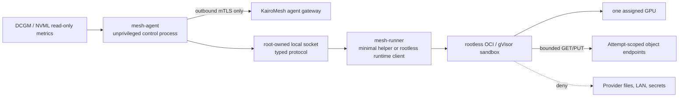
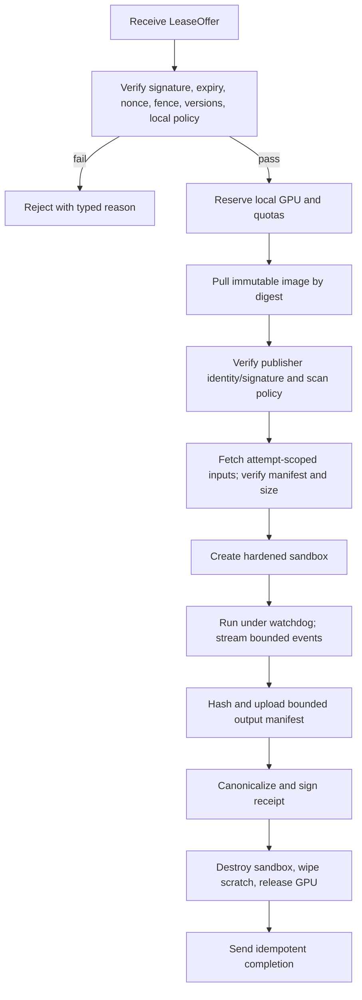

# KairoMesh node-agent design

**Status:** future design; no node-agent binary or remote runner exists in this repository
**Last reviewed:** 2026-07-17
**Initial target:** Linux, NVIDIA GPU, bounded catalog workloads

## 1. Current reality

The current Mission Control runs a deterministic sequence in the browser. It does not enroll a machine, inspect hardware, open an agent channel, launch a container, read GPU telemetry, checkpoint work, or upload an artifact. The node IDs, evidence tiers, thermals, heartbeat loss, fence change, and settlement events are synthetic.

The state-machine and ledger domain modules are real and tested, but they are not an agent. The receipt hash-chain code is real, but the current chain is generated by the web server and is not signed by a node.

This document is the security contract a future agent must satisfy before real execution can be enabled.

## 2. Goals and non-goals

### Goals

- Let a provider contribute explicitly approved GPU capacity without opening an inbound port.
- Execute only versioned, digest-pinned KairoMesh catalog templates.
- Protect the provider host and local network from requester code.
- Enforce owner-configured schedule, thermal, bandwidth, workload, and price limits locally.
- Survive duplicate/reordered control messages and reject stale leases.
- Produce bounded telemetry, artifact manifests, and an attributable execution receipt.
- Drain, revoke, update, and recover safely without a remote shell.

### Non-goals

- Arbitrary remote desktop, game streaming, SSH, interactive shell, or general-purpose VM rental.
- Privileged containers, nested container runtimes, host networking, arbitrary host mounts, or runtime-socket access.
- Protecting requester confidentiality from the provider on ordinary consumer hardware.
- Proving arbitrary computation correct.
- Running unknown public images or accepting a user-supplied command string/URL.
- Multi-node distributed training in the first pilot.
- Automatic installation or driver modification without explicit provider confirmation.

## 3. Trust model

The requester workload is hostile to the provider. The provider OS/root administrator is hostile to requester confidentiality and potentially to result honesty. The control plane is trusted to authorize assignments and maintain lease time, but may be compromised and must remain bounded by local owner policy.

An agent signature means “the holder of this enrolled key made this statement.” It does not prove the machine is unique, the provider is honest, a GPU executed the job, or telemetry is unmodified. TPM binding and remote attestation can raise assurance on supported hardware; they do not establish general result correctness.

For Observed and Isolated nodes, assume the provider can inspect plaintext job data. The agent must never receive platform master credentials or requester secrets. Sensitive jobs are prohibited until a supported Confidential tier releases keys only after verified CPU/GPU attestation.

## 4. Process architecture

The agent should be split so the component that talks to the network cannot issue arbitrary privileged runtime operations.



Preferred baseline: the control process and container daemon run without root. If a privileged helper is unavoidable, it accepts a narrow versioned request structure over a local socket, verifies caller identity and policy, never accepts shell text, and cannot modify drivers, users, firewall, or arbitrary host paths.

The agent must not expose a listener to the Internet. Provider IP and exact location are never returned to requesters.

## 5. Support matrix

The first supported matrix should be deliberately narrow and published by exact version:

- Linux distribution/kernel versions with active security support.
- NVIDIA driver versions validated against the agent and sandbox.
- NVIDIA Container Toolkit/CDI versions.
- Rootless Podman/containerd/Docker runtime versions.
- GPU models, minimum VRAM, and supported compute capability.
- gVisor `runsc --nvproxy` only for models and exact driver ABI versions gVisor supports.
- No Windows/macOS host, AMD GPU, WSL, laptop hybrid-GPU, MIG, multi-GPU topology, or VM passthrough until separately qualified.

Unsupported combinations fail enrollment with a useful reason; they are not silently downgraded. A host may remain in a diagnostics-only state without publishing an offer.

Firecracker is not the initial GPU sandbox target. Portable consumer GPU passthrough introduces IOMMU grouping, device reset, host-display ownership, memory pinning, and support-maturity problems. A rootless OCI baseline with gVisor where compatible is more buildable; a supported Kata/Confidential Containers stack is the Confidential-tier path.

## 6. Enrollment and machine identity

```mermaid
sequenceDiagram
    participant P as Provider browser
    participant C as Control plane
    participant A as New agent
    participant K as CA / KMS

    P->>C: Request one-time enrollment token
    C-->>P: Token + expiry + displayed policy
    P->>A: Paste token locally
    A->>A: Generate non-exportable key where possible
    A->>C: Token, CSR, agent version, enrollment nonce
    C->>C: Hash-compare token; consume once; authorize provider
    C->>K: Sign short-lived node certificate
    K-->>C: Certificate + trust bundle
    C-->>A: Node ID, certificate, policy, gateway endpoints
    A->>C: Outbound mTLS Hello
    C-->>A: Session nonce + minimum version
```

Requirements:

- Enrollment token is random, stored only as a hash, scoped to provider and intended node, expires in at most 10 minutes, and is consumed atomically once.
- Agent generates its private key locally. Prefer TPM-sealed/non-exportable keys; never transmit a private key to the control plane.
- Node certificate is short-lived and rotates automatically over the authenticated channel.
- Node identity is distinct from a provider user session and from a workload identity.
- Revocation, provider disable, and minimum-agent-version checks occur on every new session and lease.
- Re-enrollment after key loss creates a new key ID and auditable relationship; it does not silently inherit reputation.
- The agent refuses a control-plane certificate outside its pinned/configured trust domain.

SPIFFE/SPIRE may replace a custom certificate lifecycle later, but is not necessary for the first pilot if equivalent short-lived workload identity and rotation are implemented correctly.

## 7. Inventory and evidence

The agent reports only the minimum needed for eligibility:

- Stable KairoMesh node ID and key ID.
- Agent/runtime/OS/kernel/driver versions.
- GPU model, memory, compute capability, and a privacy-preserving GPU identifier.
- Supported CDI device names and sandbox capabilities.
- Health result, benchmark version/result, bandwidth class, storage capacity, and coarse region.
- Provider-configured availability, maximum temperature, bandwidth, workload classes, and price floor.

Do not expose full serial numbers, exact street address, public IP, MAC address, usernames, local paths, process list, installed applications, or unrelated device inventory to requesters.

### Evidence-tier truth conditions

- **Observed:** enrolled key, fresh nonce-bound inventory/benchmark, recent heartbeat, and controller-observed history.
- **Isolated:** Observed plus a successfully enforced and audited sandbox profile on a qualified host/runtime.
- **Attested:** a supported confidential CPU/GPU stack presents fresh remote evidence that matches a versioned policy before any protected key is released.

Secure Boot alone does not make a node Attested. Consumer RTX scenario data must not be marked hardware-confidential without supported evidence.

## 8. Agent channel and messages

Use a provider-initiated bidirectional gRPC stream or equivalent framed protocol over TLS 1.3/mTLS. The protocol is versioned and length-bounded. Unknown mandatory fields or unsupported policy versions fail closed.

Core messages:

| Direction | Message | Required properties |
|---|---|---|
| Agent → control | `Hello` | Node/key ID, protocol/agent version, capabilities, session nonce response |
| Agent → control | `Inventory` | Versioned, nonce-bound, size-bounded hardware/runtime facts |
| Agent → control | `Heartbeat` | Session, sequence, current attempts, local health, monotonic time delta |
| Control → agent | `LeaseOffer` | Signed assignment, expiry, job/attempt/fence, resource and local-policy-compatible limits |
| Agent → control | `LeaseAccept` / `LeaseReject` | Assignment digest, reason code, remaining capacity |
| Agent → control | `AttemptEvent` | Attempt/fence, monotonic sequence, bounded typed details, previous event hash |
| Control → agent | `Cancel` / `Drain` | Signed, expiring, job/attempt/fence and reason |
| Agent → control | `AttemptComplete` | Receipt, output manifest, exit status, final event root |

Every message is associated with the authenticated node session. The application payload also carries node/attempt/fence/sequence/nonce so a proxy, retry, or stolen old message cannot be rebound silently.

Heartbeats are not invoices and are not trusted proof of physical health. The control plane owns lease expiry using its own clock.

## 9. Assignment manifest

A future signed assignment should bind at least:

```json
{
  "version": "kairomesh-assignment/v1",
  "jobId": "job_...",
  "attemptId": "attempt_...",
  "nodeId": "node_...",
  "fencingToken": 2,
  "issuedAt": "controller timestamp",
  "expiresAt": "short controller timestamp",
  "nonce": "random value",
  "template": {
    "id": "monte-carlo-v1",
    "imageDigest": "registry/repo@sha256:...",
    "parameterManifestDigest": "sha256:...",
    "entrypointId": "approved-entrypoint"
  },
  "inputs": {
    "manifestDigest": "sha256:...",
    "totalBytes": 12345
  },
  "resources": {
    "gpuDeviceId": "server-selected-CDI-name",
    "cpuMillis": 4000,
    "memoryBytes": 8589934592,
    "pids": 128,
    "scratchBytes": 10737418240,
    "outputBytes": 268435456,
    "logBytes": 4194304,
    "wallSeconds": 900
  },
  "networkPolicyId": "none-v1",
  "verificationPolicyId": "replicate-2-v1"
}
```

This is a design example, not an implemented API.

The agent verifies the control-plane signature, node binding, expiry, nonce uniqueness, current fence, image/template policy, local provider policy, capacity, and minimum software versions before acceptance. It never translates user data into `sh -c`. Entrypoint and arguments are an argv array generated from a typed template schema.

## 10. Lease and fencing behavior

1. Control plane offers a lease with a short acknowledgement deadline.
2. Agent atomically checks local availability and records the assignment digest/fence before accepting.
3. The accepted lease renews through heartbeats; failure to renew causes the controller to mark the attempt lost.
4. A new attempt increments the job fence while queued.
5. The old agent may continue physically running, but its events and attempt-specific objects cannot become the winning output.
6. A cancellation is best effort: send graceful termination, wait a bounded interval, force kill the sandbox/cgroup, and clean ephemeral state.
7. Completion is idempotent. Duplicate completion returns the existing result; changed data with the same event/idempotency identity is rejected and audited.

The agent must not reuse an attempt directory, output prefix, nonce, or event sequence.

## 11. Execution pipeline



If any verification step fails, no job process starts. Partial input/output objects stay under the attempt prefix and are marked incomplete for lifecycle deletion.

## 12. Sandbox policy

Baseline controls for every real job:

- Rootless runtime and user namespace; application UID/GID is non-root.
- Read-only root filesystem.
- Dedicated read-only input mount and bounded write-only/output staging area.
- `tmpfs` scratch with `nodev`, `nosuid`, and `noexec` where compatible.
- Drop every Linux capability; add none unless a separately reviewed template requires one.
- `no_new_privs`, seccomp allowlist/default profile, AppArmor or SELinux confinement.
- Private PID, IPC, mount, user, cgroup, and network namespaces; never host namespaces.
- No Docker/containerd socket, KVM, BPF, FUSE, `/dev/mem`, host home, SSH keys, cloud metadata, or arbitrary devices.
- GPU injection by one exact NVIDIA CDI device. Driver capabilities default to `compute,utility`; graphics/video require a reviewed template.
- cgroup v2 CPU, memory, PID, I/O, and wall-time limits; filesystem and output quotas.
- No unrelated tenant shares a consumer GPU concurrently. MIG/partitioning requires a separately qualified stack.
- Watchdog kills the full cgroup, verifies no orphan, and drains the node if cleanup or device reset fails.

The agent itself must not mount the job's root filesystem and then parse untrusted content with privileged code unnecessarily.

## 13. Network and object access

Default job network is `none`. Inputs are staged by the agent or accessed through a narrowly controlled data path. If a template requires network:

- Route through a platform-approved egress proxy.
- Allowlist destination host, port, method, and protocol by template version.
- Resolve all A and AAAA records and block loopback, private, carrier-grade NAT, link-local, multicast, documentation/test, and cloud metadata ranges.
- Revalidate after redirects and at connection time; cap redirect count.
- Use platform DNS or a constrained resolver; log only destination metadata, never credentials/query secrets.
- Cap bytes, connections, requests, and duration.
- Block SMTP, peer-to-peer discovery, inbound listeners, and provider-LAN routing.

Object capabilities are bearer credentials. They are short-lived, method/key scoped, attempt-specific, checksum/content-length bound where supported, never printed in logs/receipts, and issued from temporary least-privilege credentials. Object versioning or conditional create prevents overwrite. The agent verifies every input hash before execution and every uploaded output hash before completion.

## 14. Checkpoints

Checkpoint support is template-specific, not a generic promise. A checkpoint record binds:

- Job, attempt, fence, template/image and input manifest digests.
- Monotonic checkpoint sequence and parent digest.
- Object key, byte count, SHA-256, creation/controller-ack time, and compatibility metadata.
- Optional encryption metadata without embedding a key.

The control plane acknowledges a checkpoint only after object integrity and policy validation. Restore uses an immutable acknowledged checkpoint and a newer fence. The old attempt cannot update the restored lineage.

Encryption at rest protects storage media, not data from a provider that created or restored the plaintext checkpoint. Confidential-tier checkpoint keys require attestation-gated release.

## 15. Telemetry and health

Use NVIDIA DCGM/NVML for qualified metrics, with bounded sampling and no requester-controlled labels. Suggested heartbeat fields:

- GPU utilization/memory utilization, memory used, temperature, power, clocks.
- Xid/driver errors, ECC/row-remap health where available, throttling reason.
- Free disk/scratch, agent/runtime health, current attempt/fence, bytes/log quota.
- No process command lines, environment variables, filenames, prompts, model data, or signed URLs.

Drain or quarantine on:

- Temperature above owner ceiling or sustained thermal/power throttling.
- Driver/Xid/ECC error beyond a versioned policy threshold.
- Agent/runtime/driver below minimum supported version.
- Scratch pressure, failed sandbox cleanup, GPU reset failure, or unexpected device change.
- Repeated receipt/output mismatch, replay, impossible telemetry, or clock anomaly.

Metrics reported by a provider-controlled host are evidence, not truth. The control plane records controller-observed connectivity and challenge results separately.

## 16. Receipt signing

The current receipt is an unsigned server-generated hash chain. A future node receipt must use a documented canonicalization format and sign the digest with the enrolled node key. It should include assignment, artifact, log/metric root, runtime, constrained hardware, time, nonce, and fence fields described in [ARCHITECTURE.md](./ARCHITECTURE.md).

The control plane verifies:

1. Canonical encoding and digest.
2. Signature cryptography.
3. Certificate chain, validity, revocation, and key authorization at assignment time.
4. Assignment/node/attempt/fence/nonce binding.
5. Image/input/output manifest integrity.
6. Required validator, independent replica, or attestation evidence.

A valid signature without authorization or policy evidence is displayed as incomplete, not green.

## 17. Provider controls

Local owner policy overrides a broader remote offer. The provider can configure:

- Availability schedule and immediate drain.
- Maximum temperature, power where supported, bandwidth, scratch, and runtime.
- Allowed workload/template classes and network-enabled job opt-out.
- GPU device(s) explicitly offered; never autodiscover-and-publish without confirmation.
- Minimum price/maximum job duration.
- Automatic update window and restart behavior.
- Local diagnostics and privacy-preserving support bundle generation.

Emergency stop kills active sandboxes and disconnects the gateway after preserving minimal controller/audit facts. It never grants KairoMesh an interactive host shell.

## 18. Updates, revocation, and rollback

- Agent releases are reproducible where feasible, signed, accompanied by SBOM/provenance, and distributed through a verified channel.
- The running agent verifies update signature and expected publisher identity before install.
- Control plane enforces a minimum safe version and can revoke a version/key/node.
- Rollback protection blocks known-vulnerable versions; emergency rollback requires signed policy and audit.
- Update failure leaves the previous known-good binary or drains the node; it does not run a partially written executable.
- Driver/runtime updates are provider-controlled and force requalification before the node becomes ready.

## 19. Local state and cleanup

Persist only enrollment key/certificate, node ID, owner policy, version metadata, minimal attempt journal, and update state. Private keys use OS permissions and hardware binding where available. Do not persist control-plane bearer tokens, requester secrets, or completed artifacts.

At startup the agent reconciles its journal against runtime/cgroups:

- Unknown live sandbox: stop, quarantine, and require review.
- Journaled live attempt with no valid lease: stop and clean.
- Completed attempt awaiting duplicate completion ACK: resend the identical signed receipt.
- Scratch/output residue: verify no live owner, wipe, and record cleanup result.

## 20. Failure and rejection codes

Use stable machine codes with safe operator messages, for example:

- `UNSUPPORTED_AGENT_VERSION`
- `UNSUPPORTED_DRIVER`
- `SANDBOX_UNAVAILABLE`
- `LOCAL_POLICY_DENIED`
- `ASSIGNMENT_SIGNATURE_INVALID`
- `ASSIGNMENT_EXPIRED`
- `NONCE_REPLAYED`
- `FENCE_STALE`
- `GPU_BUSY`
- `IMAGE_POLICY_FAILED`
- `INPUT_MANIFEST_MISMATCH`
- `RESOURCE_LIMIT_EXCEEDED`
- `NETWORK_POLICY_VIOLATION`
- `OUTPUT_MANIFEST_MISMATCH`
- `SANDBOX_CLEANUP_FAILED`
- `NODE_HEALTH_DEGRADED`

Messages sent to requesters must not expose host paths, IPs, kernel details, local usernames, or raw security logs.

## 21. Pilot acceptance checklist

No real node may publish capacity until all checks pass:

- Enrollment replay, expiry, wrong provider, key rotation, and revocation tests.
- Outbound-only connectivity verified from a provider firewall.
- Exact OS/runtime/driver/GPU qualification and negative unsupported-version tests.
- Generated runtime-spec snapshot proves every sandbox control.
- Provider-LAN, metadata IPv4/IPv6, DNS rebinding, redirect, and exfiltration tests fail closed.
- Escape/adversarial image review and host reimage procedure exercised.
- cgroup, disk, log, output, wall-time, thermal, and orphan cleanup tests.
- Duplicate/reordered/lost messages and stale-fence completion tests.
- Image substitution, input/output mismatch, receipt mutation, wrong key, and revoked key tests.
- Agent update/signature/rollback/recovery tests.
- Provider sees the residual confidentiality disclosure during onboarding.
- [RUNBOOK.md](./RUNBOOK.md) game days completed for escape, key theft, output mismatch, node loss, and control-plane outage.

## 22. Technical references

- [NVIDIA Container Device Interface](https://docs.nvidia.com/datacenter/cloud-native/container-toolkit/latest/cdi-support.html)
- [NVIDIA DCGM documentation](https://docs.nvidia.com/datacenter/dcgm/latest/user-guide/index.html)
- [gVisor GPU support](https://gvisor.dev/docs/user_guide/gpu/)
- [Docker rootless mode](https://docs.docker.com/engine/security/rootless/)
- [Kubernetes application security checklist](https://kubernetes.io/docs/concepts/security/application-security-checklist/)
- [Sigstore verification](https://docs.sigstore.dev/cosign/verifying/verify/)
- [NVIDIA Confidential Containers attestation](https://docs.nvidia.com/datacenter/cloud-native/confidential-containers/1.0.0/attestation.html)
