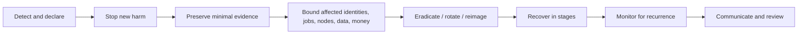

# KairoMesh operations and incident runbook

**Status:** current demonstration operations plus required pilot procedures
**Last reviewed:** 2026-07-17
**Emergency principle:** protect people and hosts first; preserve evidence second; restore service third

## 1. Know which system is running

Before responding, identify the mode.

### Demonstration mode — current repository

- Synthetic in-process node inventory.
- Client-side presenter timers for jobs, telemetry, failure, recovery, mismatch, and credits.
- Stateless quote and receipt endpoints.
- No user accounts, providers, remote agents, containers, artifacts, database, or live money.
- Process-local quote rate limit only.

An alarming event inside Mission Control is normally a scripted scenario. It cannot compromise a remote provider because none is connected. A vulnerability in the public web application or its hosting remains a real security incident.

### Pilot/production mode — future

The procedures marked **Future control** assume authenticated users, durable jobs, object storage, node agents, sandboxes, signed receipts, and a payment provider. Those controls do not exist yet. Real workloads must remain disabled until the controls and named on-call roles exist and have been exercised.

## 2. Severity

| Severity | Definition | Examples | Initial response target |
|---|---|---|---|
| SEV-0 | Immediate risk to people, widespread illegal abuse, or active compromise requiring emergency authority | Credible physical threat; widespread criminal workload; signing/KMS root compromise | Immediate; contact appropriate emergency/legal authority under approved policy |
| SEV-1 | Confirmed or likely critical security/data/financial incident | Container escape; customer model/data disclosure; control-plane admin compromise; corrupted financial ledger; malicious agent update | Acknowledge within 15 minutes during an operated pilot; stop affected processing |
| SEV-2 | Material degradation or bounded security incident | Multiple-node outage; revoked key used; output mismatch cluster; object capability leak; severe API abuse | Acknowledge within 30 minutes |
| SEV-3 | Limited defect with workaround and no known sensitive impact | One node unhealthy; one quote path failing; synthetic receipt regression | Same working day |
| SEV-4 | Cosmetic/documentation/low-risk issue | Presenter animation or copy defect | Normal backlog |

Targets are operational objectives, not contractual SLAs.

## 3. Roles for a real pilot

One person may hold multiple roles in a small team, but every incident names them explicitly.

- **Incident commander (IC):** owns severity, decisions, timeline, and handoffs.
- **Security lead:** containment, evidence, threat analysis, credential/key decisions.
- **Operations lead:** service/node/storage/database recovery.
- **Data/privacy lead:** affected data, notification analysis, deletion/preservation conflict.
- **Marketplace/payments lead:** holds transfers, reconciliation, provider/requester cases.
- **Communications lead:** status updates and affected-party communication.
- **Scribe:** append-only timeline, commands/actions, hypotheses, evidence references.

No one approves their own emergency settlement adjustment or deletes the only evidence copy.

## 4. Universal response loop



### First 15 minutes

1. Open an incident record with UTC start time, reporter, symptom, and initial scope.
2. Assign IC and severity. Treat unknown scope as the higher plausible severity.
3. Stop the narrowest source of new harm: template, node, account, assignment worker, artifact capability issuer, settlement worker, or public route.
4. Do not destroy a suspected host, rotate away the only evidence, or notify an attacker before the security lead decides preservation needs.
5. Record every action, actor, UTC time, result, and rollback.
6. Separate facts, hypotheses, and decisions.
7. Establish the next update time even if there is no new information.

### Evidence handling

Preserve only what is necessary and authorized:

- Request/job/attempt/node/key IDs, policy/version, fence, controller timestamps, and event/receipt digests.
- Relevant immutable audit, gateway, database, object access, registry, CI, and deployment logs.
- Runtime spec, image digest/signature/provenance, agent/runtime/driver versions, and health error codes.
- Ledger transaction/entry IDs and payment-processor object IDs, not raw card/bank data.

Never paste private keys, bearer tokens, signed URLs, raw customer payloads, prompts, model weights, full provider addresses, or unnecessary personal data into chat, tickets, or public issues. Hash evidence exports and record custody. Follow legal preservation requirements before deletion.

## 5. Current demonstration checks

Run from the repository root.

```bash
npm ci
npm run typecheck
npm run lint
npm test
npm run build
```

Check liveness after starting the application:

```bash
curl --fail --silent http://localhost:3000/api/health
```

Expected properties include `status: "ok"` and `mode: "demonstration"`. This endpoint does not prove that an external database, queue, storage service, or agent is healthy; none is configured.

Focused domain checks:

```bash
npx vitest run src/lib/state-machine.test.ts src/lib/ledger.test.ts
npx vitest run src/lib/scheduler.test.ts src/lib/proof-chain.test.ts src/lib/schemas.test.ts
```

### Demo reset

- Use the Mission Control reset action or refresh the page.
- Restart the Next.js process to clear the process-local rate-limit map.
- No provider, artifact, hold, or payout needs reconciliation because all are synthetic.
- If a receipt fails browser verification unexpectedly, follow section 7; do not describe it as a compromised node.

## 6. Quote API unavailable or incorrect

**Applies now:** yes.
**Typical severity:** SEV-3; SEV-2 if public abuse or a security regression is involved.

### Signals

- `/api/quote` returns elevated 5xx, widespread 409, invalid scores, or timeouts.
- Valid requests return `INVALID_REQUEST` or no eligible capacity unexpectedly.
- Rate-limit responses affect normal traffic.

### Triage

1. Confirm `/api/health` and capture the quote response's `X-Request-Id`.
2. Reproduce with a schema-valid request; do not use customer data.
3. Run scheduler/schema tests.
4. Verify seeded offer states, evidence tiers, price ceiling, VRAM, requested GPU count, and priority total.
5. Check recent application/dependency/configuration changes.
6. Check `KAIROMESH_TRUST_PROXY`. When false, all traffic shares the anonymous demo bucket. When true, the route accepts only a bounded IP-shaped first `x-forwarded-for` value, so the controlled reverse proxy must overwrite that header before traffic reaches the app.

### Contain and recover

- If responses are wrong, disable or roll back the affected deployment rather than returning plausible bad quotes.
- If abused, apply hosting-edge limits; the in-process limiter is not a distributed defense.
- Restore from the last tested build and verify a known request twice for deterministic equality.

### Close when

- Health, schema, scheduler, and build checks pass.
- A known request produces the expected deterministic plan.
- Error/rate-limit metrics return to baseline.
- Root cause and prevention test are recorded.

## 7. Demo receipt missing or invalid

**Applies now:** yes.
**Typical severity:** SEV-3.

### Signals

- `/api/demo/receipt` fails, has a non-contiguous sequence, or browser verification reports invalid.
- Server and browser root hashes differ.

### Triage

1. Confirm the endpoint returns `simulated: true` and the honest claim string.
2. Run proof-chain tests.
3. Compare canonicalization logic in server and browser implementations, especially object key ordering and UTF-8 encoding.
4. Confirm no proxy transforms JSON values or truncates the response.
5. Treat a failed deterministic fixture as a software regression, not proof of a provider attack.

### Recover

- Roll back the receipt/canonicalization change or add a versioned migration; never silently redefine an existing receipt version.
- Keep the receipt withheld in the UI while verification fails.

### Close when

- Server tests and browser recomputation agree on the known root.
- A mutated copied block is rejected.
- Documentation still says hash chain, not digital signature or proof of computation.

## 8. Node heartbeat loss and failover

**Future control. Not connected today.**
**Typical severity:** SEV-3 for one node; SEV-2 for correlated loss.

### Signals

- Three missed heartbeats, gateway disconnect, lease-renewal expiry, or agent health failure.

### Immediate actions

1. Mark the attempt `LOST`; stop routing new work to the node.
2. Move the job to its allowed recovery state in one transaction.
3. Increment the fence while queued and create a new attempt/output prefix.
4. Choose a replacement outside active provider/operator failure domains.
5. Do not delete the old attempt or objects until retention/verification decides their use.

### Investigation and recovery

- Determine one node versus provider/ASN/region/agent-version correlation.
- Restore only an acknowledged checkpoint whose template/input/parent digest matches.
- If no safe checkpoint/capacity exists, fail/refund according to the versioned policy rather than claiming recovery.
- Late old-fence events are rejected and retained as minimal audit evidence.

### Close when

- Job completed or reached an honest terminal/refund state.
- Old attempt cannot mutate the winner or settlement.
- Node passed diagnostics/requalification before `ready`, or remains drained.

## 9. Output mismatch or suspected dishonest provider

**Future control; currently a presenter scenario.**
**Typical severity:** SEV-2; SEV-1 if systemic/colluding or sensitive.

### Immediate actions

1. Do not settle. Keep future funds pending/held; for the current demo, only show zero synthetic payout.
2. Quarantine the node from new assignments without publicly accusing the provider.
3. Preserve assignment, manifests, receipts, validator output, replica identities, policy version, and controller times.
4. Launch an independent verifier/replica only if policy, data classification, and budget authorize it.

### Investigation

- Confirm deterministic assumptions, seed, image/input digest, driver/architecture tolerance, and validator version.
- Distinguish malformed/corrupt output, nondeterminism, driver fault, stale fence, malicious output, and verifier bug.
- Check provider/operator/ASN correlation between replicas.
- Do not rely on provider-local telemetry as independent evidence.

### Recovery

- If platform/verifier error: correct policy, re-run affected jobs, restore node reputation, and communicate.
- If node fault: keep drained until hardware/driver diagnostics pass.
- If likely fraud: revoke node credentials, hold future transfer under terms, open dispute/appeal, and review linked identities.
- If inconclusive: return/hold funds per disclosed policy; do not mark output verified.

### Close when

- Outcome, accounting state, provider status, requester communication, and appeal route agree.
- A regression/canary test covers the root cause.

## 10. Stale fence, replay, or duplicate event

**Future control; domain rejection logic exists in tests.**
**Typical severity:** SEV-2 if accepted; SEV-3 if correctly rejected.

### Immediate actions

- If rejected as designed, record metrics and investigate repeated attempts without stopping healthy jobs.
- If a stale event changed state, output, or settlement: pause settlement and affected job processing; declare SEV-1/2.

### Investigation

- Compare job `stateVersion`, current fence, attempt ID, nonce, sequence, lease expiry, object prefix, and idempotency key.
- Check database transaction isolation and unique constraints.
- Determine benign retry/reordering versus stolen key or malicious provider.

### Recovery

- Restore authoritative state from append-only events/audit only after confirming invariants.
- Supersede/revoke the compromised lease or key.
- Reconcile artifacts and every ledger entry for the job.
- Add a concurrent/reordered-event regression test.

### Close when

- Exactly one winning attempt and final financial outcome remain.
- The stale path cannot be replayed successfully.

## 11. Suspected sandbox escape or provider-host compromise

**Future control.**
**Severity:** SEV-1.

### Immediate actions

1. Stop new assignments globally or for the affected runtime/template/version.
2. Instruct affected providers to disconnect network if safe, preserve power/state if forensics requires it, and avoid using the host for personal/sensitive activity.
3. Revoke affected node certificates and image/template authorization.
4. Quarantine all nodes sharing vulnerable runtime, driver, kernel, image, or agent version.
5. Do not attempt interactive cleanup from the compromised agent channel.

### Investigation

- Preserve runtime spec, cgroup/sandbox identity, image digest/signature/provenance, host/agent/runtime/kernel/driver versions, relevant audit/gateway logs, and minimal network indicators.
- Engage qualified incident response. Provider consent and local law govern host acquisition.
- Assume agent keys and all secrets reachable from the host are compromised.

### Eradication and recovery

- Reimage from known-good media; do not return a merely “cleaned” host to service.
- Rotate/revoke reachable credentials and signing trust as scoped by investigation.
- Patch and requalify exact host/runtime/driver matrix.
- Resume with one canary node/template, heightened monitoring, then staged rollout.

### Close when

- Scope is bounded, hosts reimaged, credentials rotated, vulnerable path fixed/reviewed, providers/requesters notified as required, and game-day regression passes.

## 12. Requester confidentiality exposure on a provider

**Future control.**
**Severity:** SEV-1 for undisclosed sensitive data; severity depends on content/scope.

### Immediate actions

1. Stop new jobs on affected node/provider/tier and revoke artifact capabilities.
2. Identify which plaintext objects/jobs were accessible and during what interval.
3. Preserve access/audit evidence without copying more customer data.
4. Notify privacy/legal owner; do not promise secrecy on Observed/Isolated nodes.

### Investigation

- Was the workload incorrectly classified, disclosure absent, access outside normal provider-root capability, object URL leaked, or Confidential attestation/key release bypassed?
- Bound affected payloads, checkpoints, outputs, logs, backups, support bundles, and provider personnel.

### Recovery

- Delete/revoke accessible artifacts where legally permitted; rotate embedded credentials and treat exposed proprietary material as compromised.
- Fix tier/policy/key-release control and prevent further submission.
- Notify affected parties/regulators according to applicable law and approved counsel.

### Close when

- Scope, deletion/preservation, notification, remediation, and future tier language are complete.

## 13. Node key or agent release compromise

**Future control.**
**Severity:** SEV-1 for signing/update compromise; SEV-2 for one node key.

### Immediate actions

- Revoke key/certificate/version and stop accepting its new sessions, receipts, or updates.
- Pause settlement for jobs relying only on affected evidence.
- Quarantine related nodes without deleting receipt history.
- For release-signing compromise, halt agent distribution and new assignments globally.

### Recovery

- Issue a new trust root/signer only through the documented ceremony; publish revocation and minimum version.
- Re-enroll a reimaged node with a new key. Do not copy old reputation automatically.
- Reverify affected outcomes using independent evidence or refund/hold under policy.
- Audit transparency/provenance/CI and rotate reachable secrets.

### Close when

- Old credentials fail, new path is independently reviewed, affected jobs resolved, and update/enrollment replay tests pass.

## 14. Image, registry, CI, or dependency compromise

**Applies now to the web supply chain; future impact includes jobs/agents.**
**Severity:** SEV-1/2 depending on execution and reach.

### Immediate actions

- Disable compromised template/image/release/deployment and stop promotion.
- Revoke signature/key if compromised; preserve digest/provenance/build logs.
- Identify every deployment/node/job that consumed the artifact.

### Recovery

- Rebuild in a clean environment from reviewed source and pinned dependencies.
- Rotate build/deploy/registry credentials.
- Reimage hosts if artifact execution could have crossed a trust boundary.
- Publish fixed digest/version and block the old one explicitly.

### Close when

- Clean provenance and signatures verify, scope is reconciled, and consumers are updated/notified.

## 15. Ledger imbalance, double settlement, or reconciliation delta

**Future financial control; pure demo-ledger invariants exist today.**
**Severity:** SEV-1 for live money; SEV-3 for a test/demo defect.

### Immediate actions

1. Pause future settlement/transfers, not job evidence collection.
2. Preserve database/payment snapshots and append-only audit; do not edit entries in place.
3. Identify affected currency, accounts, jobs, idempotency keys, processor events, and time range.

### Investigation

- Run ledger invariant and processor reconciliation read-only.
- Check duplicate webhook/message delivery, concurrency, rounding/minor units, refund/chargeback, manual adjustment, and partial database transaction.
- Separate internal balanced ledger from external processor cash movement.

### Recovery

- Correct through a new authorized compensating transaction linked to the incident; never rewrite history.
- Require two-person approval for live financial adjustment.
- Replay only idempotent events after unique constraints are confirmed.
- Notify affected parties under payment terms.

### Close when

- Internal entries balance; held liabilities match; processor/bank reconciliation is zero or documented; one terminal result/job; regression test added.

Never describe demo-credit reserve as escrow. No current ledger value is money.

## 16. Object capability or artifact leak

**Future control.**
**Typical severity:** SEV-1/2 depending on data.

### Immediate actions

- Revoke issuing temporary credential or object policy where possible; expire/deny affected keys and pause capability issuance.
- Stop affected job/node access; preserve object access logs.
- Identify objects, methods, IPs/principals, TTL, and whether data was read or overwritten.

### Recovery

- Rotate credentials, create new immutable keys, re-upload/reverify clean artifacts, and invalidate derived results if integrity is uncertain.
- Shorten/sign required headers and remove URLs from logs/errors.
- Apply privacy notification procedure if confidential content was exposed.

### Close when

- Old capability is unusable, object integrity and access scope are known, data obligations resolved, and leak path tested.

## 17. API abuse, denial of service, or SSRF

**Applies now to web/API abuse; SSRF becomes material with future fetches.**

### Immediate actions

- Apply edge block/rate/concurrency control based on trusted signals.
- Disable the narrow route/template/fetch capability if internal access is plausible.
- Preserve request IDs, normalized source, route, status, timing, and safe destination metadata.

### Investigation

- Look for forged forwarding headers, distributed sources, oversized/chunked bodies, parser depth, expensive scheduler parameters, redirect chains, alternate IP encodings, IPv6, and DNS rebinding.
- Never fetch an attacker URL to “test” it from a privileged network.

### Recovery

- Add an absolute streaming body cap and trusted-edge identity.
- Prefer approved object/registry identifiers over arbitrary URLs.
- Route future outbound traffic through a deny-by-default proxy and validate all resolved A/AAAA addresses.

## 18. Harmful-workload or abuse report

**Future control. Current demo cannot run submitted code.**

1. Record the report privately with minimum necessary information.
2. If imminent physical harm is credible, escalate under the emergency/legal policy; do not independently investigate dangerous content beyond role.
3. Suspend the relevant template/job/account/node narrowly; preserve required evidence.
4. Keep reporter identity confidential where possible.
5. Distinguish platform abuse, compromised account, provider misconduct, and false report.
6. Apply a documented appeal and reinstatement process.
7. Feed confirmed patterns into catalog/network/account safeguards without storing unnecessary harmful content.

## 19. Public web vulnerability

**Applies now.**

- Follow [SECURITY.md](../SECURITY.md) for private intake.
- For confirmed remote code execution, secret exposure, authentication bypass after auth exists, dependency compromise, or stored XSS with sensitive impact: declare SEV-1/2 and remove/rollback affected deployment.
- Rotate hosting/deployment secrets reachable from the affected environment.
- Review logs for exploitation before patch time; do not publish exploit details before users can update.
- Validate CSP/headers, typecheck, lint, tests, build, and a targeted regression before redeploying.

## 20. Control-plane outage or data-store recovery

**Future control.**

- Stop new lease issuance if authoritative state is unavailable. Agents may finish locally but cannot assume settlement.
- Do not restore from a replica that can roll fencing tokens or job versions backward.
- Fence the old primary before promoting a new one.
- Reconcile leases, attempts, object prefixes, outbox offsets, receipts, and ledger before resuming settlement.
- Resume read-only status first, then quote/job creation, then assignments, then verification, then settlement.
- Agents with no valid renewed lease stop at the local deadline and retain only the minimal retry journal.

## 21. Communications

### Internal update template

```text
Incident: KM-YYYY-NNN
UTC time / severity / IC:
Confirmed facts:
User/provider/data/money scope:
Containment completed:
Current risk:
Next action and owner:
Next update time:
```

### External update principles

- Say what is known, what is unknown, affected function, user action, and next update.
- Do not call synthetic demo behavior a live incident.
- Do not speculate about an attacker/provider or reveal provider/requester identity.
- Do not say “no data accessed” unless evidence supports it.
- Do not claim encryption/confidentiality/attestation outside its exact reviewed boundary.
- Coordinate vulnerability details so users can update before exploitation guidance is public.

## 22. Recovery validation

Before closing any SEV-1/2:

- Containment remains effective after restart/failover.
- Revoked keys/tokens/versions fail.
- State, fence, artifact, receipt, and ledger invariants pass.
- No affected node returns to `ready` without requalification.
- Monitoring covers the original indicator and plausible variants.
- Backlog jobs and held future transfers have explicit disposition.
- Privacy/legal/payment decisions and affected-party communications are recorded.
- A permanent regression test or control exists.

## 23. Post-incident review

Complete a blameless review within five working days for SEV-1/2:

- Impact and user/provider/data/money scope.
- UTC timeline from first cause through detection, containment, recovery, and communication.
- Technical and organizational root causes; why existing controls did not prevent/detect sooner.
- What went well and what increased harm/time.
- Corrective actions with owner, deadline, priority, verification, and rollback.
- Threat-model, architecture, runbook, disclosure-language, and test changes.

An incident remains open until critical actions have verified completion, not merely a ticket.

## 24. Required game days before a pilot

Exercise at least quarterly and before expanding trust scope:

1. Agent heartbeat loss and stale old-fence completion.
2. Deterministic output mismatch and false-positive verifier.
3. Node key theft and certificate revocation.
4. Vulnerable agent/image release and global version block.
5. Suspected container escape and provider reimage.
6. Object capability disclosure containing sensitive test data.
7. Duplicate settlement/webhook and one-unit reconciliation delta.
8. Database primary loss without fence rollback.
9. Abuse report with imminent-harm escalation.
10. Confidential-tier attestation/key-release failure, before that tier exists.

Use synthetic data and sandboxed infrastructure during exercises. Record measured detection, containment, recovery, and communication time.
