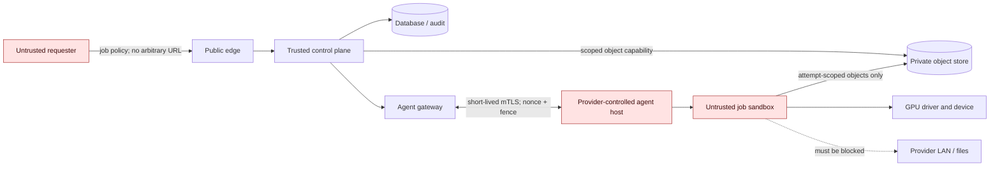

# KairoMesh threat model

**Status:** demonstration threat model and production security requirements
**Last reviewed:** 2026-07-17
**Review triggers:** real node agent, authentication, persistent storage, third-party registry, live customer data, or payment integration

## 1. Scope and security claim

KairoMesh's proposed production system has two mutually hostile parties:

- A requester can submit a malicious workload that targets the provider host, GPU driver, local network, other jobs, or the platform.
- A provider controls the physical host and can target the requester's code, inputs, model weights, outputs, evidence, or payment.

The control plane must minimize trust in both. It cannot eliminate it on ordinary consumer hardware.

The current repository is a deterministic demonstration. It does not execute containers, contact providers, store customer artifacts, authenticate users, sign receipts, attest hardware, or move money. Its fixture fields and animations must not be interpreted as security evidence.

### Allowed current claims

- The scheduler is deterministic and explainable over synthetic inputs.
- The receipt event chain is tamper-evident after its root hash is known.
- Browser code recomputes that chain independently of the server implementation.
- State-machine and demo-ledger invariants are implemented and tested as pure libraries.
- Failure, mismatch, quarantine, refund, and settlement are labeled simulations.

### Disallowed current claims

- “Live GPU network,” “private consumer GPU,” “zero trust,” or “secure arbitrary code execution.”
- “Signed receipt,” “hardware attested,” or “proof of computation.”
- “Encrypted checkpoint” as an implemented storage property.
- “Escrow,” “wallet,” “payment,” “payout,” or any implication that demo credits have value.
- Correctness of arbitrary ML, rendering, or simulation output.

## 2. Most important residual risk

> **A provider with root control of an ordinary consumer GPU host can potentially inspect plaintext inputs, model weights, process memory/VRAM, and outputs. A hardened container protects the provider from the workload; it does not protect the workload from the provider.**

Transport encryption, encrypted object storage, signed images, gVisor, and an honest agent do not remove this risk. Requesters must not send secrets or sensitive/proprietary data to Observed or Isolated nodes. A Confidential tier requires a separately reviewed CPU/GPU trusted execution environment on supported hardware, successful remote attestation against known-good measurements, and policy-gated key release. Even then, metadata, denial of service, side channels, and attestation-supply-chain risk remain.

The present `observed`, `isolated`, and `attested` fixture values are scenario labels only.

## 3. Assets

| Asset | Security property |
|---|---|
| Provider operating system, files, credentials, LAN, and physical GPU | Confidentiality, integrity, and availability against requester code |
| Requester input, source, model weights, prompts, checkpoints, and output | Confidentiality and integrity against provider and other tenants |
| Job/template policy and assignment | Authenticity, integrity, freshness, and authorization |
| Node identity, key, evidence, health, reputation, and offer | Authenticity, freshness, non-replay, and bounded disclosure |
| Job/attempt state and fencing token | Monotonicity, durability, and exactly one winning attempt |
| Artifact manifests and receipt evidence | Integrity, origin attribution where implemented, and privacy |
| Demo-credit or future financial ledger | Balance, atomicity, idempotency, authorization, and auditability |
| Control-plane keys, database, object credentials, and administrator access | Confidentiality, least privilege, rotation, and auditability |
| Service capacity and marketplace fairness | Availability and resistance to manipulation/concentration |

## 4. Data classification

| Class | Examples | Current handling | Production requirement |
|---|---|---|---|
| Public | Product copy, template identifier, coarse region | May appear in pages and receipts | Integrity and change control |
| Synthetic | Seeded offers, presenter telemetry, demo credits | In source/client memory | Must remain labeled synthetic |
| Account | User/provider identity, coarse location, payout status | Not implemented | Tenant isolation, minimization, deletion, audited support access |
| Workload confidential | Inputs, prompts, models, checkpoints, outputs | Must not be submitted | Private object storage; no Community/Isolated confidentiality promise; Confidential tier only after attestation review |
| Secret | API tokens, signing keys, registry/object credentials, signed URLs | Not implemented | KMS/secret manager, short lifetime, never logged or placed in receipts |
| Security evidence | Digests, certificates, attestation tokens, health events | Demo hashes only | Integrity, freshness, bounded retention, privacy review |
| Financial | Bank/card data, tax identity, real balances | Not implemented | Payment provider boundary, least retention, reconciliation, compliance review |

Public receipts must contain commitments/digests, not raw artifacts, prompts, personal data, secrets, signed URLs, full GPU serials, or exact provider addresses.

## 5. Actors and assumptions

### Threat actors

- Anonymous web attacker or bot.
- Authenticated malicious requester.
- Malicious or compromised provider/root administrator.
- Colluding or Sybil providers.
- Compromised node agent or stolen node key.
- Compromised dependency, registry, image publisher, CI runner, or update server.
- Curious, malicious, or compromised KairoMesh administrator.
- Payment fraudster or disputed account when live money exists.
- Accidental operator error and ordinary infrastructure failure.

### Assumptions for the production target

- The requester browser and submitted workload are untrusted.
- The provider OS is untrusted relative to requester confidentiality and result honesty.
- The sandbox/host kernel and GPU driver are trusted only to protect the host in Observed/Isolated tiers.
- The control plane, database, KMS, and policy signer are trusted but auditable.
- TLS protects traffic from passive network attackers; endpoint compromise remains in scope.
- Messages may be duplicated, delayed, reordered, or delivered after a lease expires.
- A signature proves control of a key, not physical execution or honest measurement.
- Hash equality is meaningful only for deterministic tasks; task-specific tolerance is necessary otherwise.

## 6. Trust boundaries and data flow

The arrow from the job to the provider LAN represents an attack path, not an allowed flow. Production egress policy must block it.

## 7. Threat register

Risk ratings assume a future pilot with real nodes and data. “Current control” refers only to this repository.

### Requester and workload threats

| ID | Threat and impact | Current control | Required production control | Residual risk |
|---|---|---|---|---|
| W-01 Critical | Container/GPU-driver escape compromises provider host | No code execution exists | Catalog-only digest-pinned images; signature policy; rootless non-root sandbox; read-only root; drop all capabilities; `no_new_privs`; seccomp; AppArmor/SELinux; no host namespaces/runtime socket/mounts; patched kernel/runtime/driver; gVisor where supported; external review | Shared-kernel and GPU-driver zero-days; provider must be able to drain and reimage |
| W-02 High | Workload scans provider LAN, reaches cloud metadata, exfiltrates, sends spam, or attacks others | Demo has no job network | Network-none by default; allowlisting egress proxy only for approved templates; block loopback, RFC1918, link-local, metadata IPv4/IPv6, and all resolved A/AAAA private addresses; DNS rebinding defense; bandwidth/connection quotas and audit | Approved destinations can be compromised; covert channels and abuse may remain |
| W-03 High | CPU/RAM/PID/disk/log/output/GPU exhaustion or thermal damage | Schema limits demo duration/GPU count; no execution | cgroup v2 and filesystem quotas; maximum decompressed bytes/files; PID/ulimit; wall-clock watchdog; log truncation; output quota; one unrelated tenant per consumer GPU; temperature/Xid/ECC drain policy | Driver hangs may require host reboot; physical wear cannot be eliminated |
| W-04 High | Malicious image or dependency executes before policy is enforced | UI uses fixed scenario presets, but no signatures are verified | Server-owned template version; immutable image digest; Cosign identity/policy; SBOM and vulnerability/malware scan; approved registry; admission before pull/run; signed agent releases | Authorized publisher or CI compromise remains possible |
| W-05 Medium | Filename, archive, log, ANSI, or HTML injection targets operator/UI | Zod protects quote fields; React escapes text | Server-generated object keys; path normalization; reject links/special files/traversal; bounded archive extraction; attachment disposition; ANSI/control stripping; contextual escaping; CSP | Parser and rendering vulnerabilities remain |
| W-06 High | Password cracking, malware, harassment, prohibited content, or other abusive workloads | Only local fixed scenarios; no arbitrary execution or egress | Acceptable-use policy; identity and risk-based limits; approved workload catalog; no arbitrary remote desktop/shell; reporting; review queue; suspension; global/template/node kill switches; legally required handling | Content classification is imperfect; jurisdictional obligations vary |

### Provider and result threats

| ID | Threat and impact | Current control | Required production control | Residual risk |
|---|---|---|---|---|
| P-01 Critical | Provider reads requester data/model/output | Warning only; no real data accepted | Clear tier disclosure before submission; prohibit sensitive data on Observed/Isolated; no customer/platform secrets; Confidential tier only after CPU/GPU attestation and policy-gated key release | Root visibility remains on consumer nodes; TEE metadata/side channels/DoS remain |
| P-02 High | Provider fabricates execution, output, duration, or telemetry | Deterministic mismatch animation and hash-chain demo | Controller-observed lease time; signed assignment/receipt; input/output digest manifests; task validator; hidden canaries; risk-weighted independent re-execution; delayed payout/quarantine | Root can forge ordinary local telemetry; colluding providers can agree on false output |
| P-03 High | Provider replays old evidence or submits late output after failover | Tested state version and fencing-token library | Controller nonce and expiry; short-lived lease; monotonic fence persisted transactionally; attempt-specific immutable output prefix; reject/audit stale completion; verifier binds assignment digest | Database/control-plane compromise can defeat fencing |
| P-04 High | Node spoofing, cloned agent key, or rollback to vulnerable agent | Not implemented | One-time enrollment token; CSR; short-lived mTLS cert; key revocation; minimum version; signed/TUF-style updates; TPM-sealed key and measured boot where possible | Provider controls its host; software identity alone cannot prove physical uniqueness |
| P-05 High | Sybil/colluding providers manipulate verification, reputation, or price | Fixture data only | Payout/KYC identity where legally appropriate; device/evidence binding; provider/operator/ASN anti-affinity; canaries; delayed earnings; concentration limits; reputation from measured jobs, not reviews | Determined collusion and identity rental remain possible |
| P-06 Medium | Provider exposes exact address or requester learns host identity and attacks it | UI exposes city/region only | Outbound-only agent connection; relay/control-plane mediation; coarse public geography; never disclose host IP or serial; separate support access | Network infrastructure and legal process may reveal identity |
| P-07 High | Checkpoint rollback or equivocation causes incorrect resumed output | Presenter demonstrates a fence, not real checkpoints | Hash-bound monotonic checkpoint sequence; controller acknowledgment; immutable storage version; assignment/fence binding; verifier checks ancestry | Malicious deterministic code can still create plausible bad checkpoints |

### Control-plane, storage, and supply-chain threats

| ID | Threat and impact | Current control | Required production control | Residual risk |
|---|---|---|---|---|
| C-01 Critical | Tenant IDOR or authorization bypass exposes jobs, artifacts, or balances | No auth or tenant data exists | Central authentication; deny-by-default authorization on every object/action; tenant-scoped API and storage paths; row-level policy; security tests; audited support impersonation | Application and policy bugs remain |
| C-02 High | API flood, parser exhaustion, forged forwarding IP, or distributed denial of service | Small schema, streaming 12 KB cap, bounded 30/min process-local limiter, opt-in validated forwarding key | Trusted edge-derived client identity; WAF; distributed token bucket; per-account/concurrency quotas; timeouts; circuit breakers; autoscaling | Volumetric attacks can exceed capacity |
| C-03 High | SSRF through image, input, webhook, or validation URL reaches internal services | Current quote API fetches no user URL | Do not accept arbitrary URLs; registry/object identifiers only; allowlist; URL normalization; resolve and validate all A/AAAA results at connection time; block redirects/private ranges; egress proxy | Allowed service compromise and DNS infrastructure attacks remain |
| C-04 Critical | Race, duplicate delivery, or retry creates double reservation/settlement | Pure ledger rejects duplicate/finalized operations in memory | Serializable DB transaction; unique scoped idempotency key; unique settlement/job; balanced-entry constraint/trigger; transactional outbox; reconciliation | Database/operator compromise; payment processor asynchronous reversals |
| C-05 High | Presigned object URL leaks or is reused/overwrites data | No object store | Bearer-token treatment; short TTL; single key/method; attempt prefix; checksum and content-length binding; write-once/versioning/conditional create; no list; redact logs; revocable temporary issuer | URL works until expiry; authorized node can copy plaintext |
| C-06 High | Registry/CI/dependency/update compromise distributes malicious code | Lockfile and ordinary CI scripts only | Protected branches; pinned actions/dependencies; isolated builds; secret scan; SAST; SBOM; signed images/releases; provenance; two-person signing policy; emergency revoke | Trusted builder/signer compromise remains |
| C-07 High | Administrator or control-plane compromise reads data or changes policy | No customer data or admin console | Least-privilege RBAC; separate duties; KMS; short-lived admin access; approval for sensitive actions; immutable audit; alerting; encrypted storage; deletion policy | A sufficiently privileged compromise remains critical |
| C-08 Medium | Receipt leaks sensitive metadata or enables provider/requester correlation | Demo receipt uses synthetic IDs and details | Minimize fields; hash constrained GPU identifier; coarse region; no prompt/path/URL/secret; private receipt by default; retention and export controls | Timing and workload metadata may still be identifying |
| C-09 High | Evidence chain is presented as proof/signature when it is only a hash chain | Endpoint includes an honest claim string | UI separates chain valid, signature valid, signer authorized, attestation passed, validator passed; fail closed on missing evidence; versioned receipt policy | Users may still over-trust a polished visualization |

### Financial and legal threats

| ID | Threat and impact | Current control | Required before live money | Residual risk |
|---|---|---|---|---|
| F-01 Critical | Fraud, chargeback, negative balance, or payout to malicious provider | No live money; `bigint` demo credits only | Regulated marketplace payment provider; KYC/onboarding; sanctions/export and regional review; payout delay; refund/dispute flow; reserves; webhook signature/replay protection; daily reconciliation | Platform may retain loss liability depending on payment flow |
| F-02 Critical | “Escrow” representation creates legal/user harm | Documentation and UI say demo-credit hold | Legal review of exact funds flow and customer language; use “reserved/pending transfer” unless licensed/authorized | Rules differ by jurisdiction and product structure |
| F-03 High | Provider/customer disputes correctness or meter | Deterministic presenter only | Versioned quote, assignment, controller time, receipt, validator evidence, retention, human appeal and audit export | Nondeterministic output can be inherently disputable |
| F-04 High | Tax, worker classification, export control, licensing, or consumer protection failure | Not in scope of demo | Jurisdiction-specific counsel and operational ownership before launch | Legal requirements evolve |

## 8. Security controls by evidence tier

| Control | Observed | Isolated | Attested |
|---|---:|---:|---:|
| Enrolled short-lived node identity | Required | Required | Required |
| Fresh health/benchmark evidence | Required | Required | Required |
| Digest-pinned approved template | Required | Required | Required |
| Rootless hardened sandbox | Recommended | Required | Required inside confidential stack where supported |
| Network deny-by-default | Required | Required | Required |
| Provider can read workload data | **Assume yes** | **Assume yes** | Policy-dependent after successful attestation |
| CPU/GPU remote attestation | No | No | Required |
| Secret/key release gated on evidence | Never | Never | Required |
| Independent result validation | Risk-based | Risk-based | Still required for correctness where appropriate |

“Attested” is not a synonym for correct, available, anonymous, side-channel-free, or legally compliant.

## 9. Abuse safeguards

The first real pilot must remain catalog-only. The repository's current presets are fixed scenarios, not signed production templates.

Production safeguards:

1. A server-owned template version fixes image digest, entrypoint/argv schema, resource ceiling, network policy, input/output schema, validator, and retention.
2. Requesters provide typed parameter values, never shell fragments, host paths, runtime flags, device lists, arbitrary registries, or arbitrary URLs.
3. No remote desktop, SSH, interactive shell, nested runtime, privileged workload, host networking, or runtime socket.
4. Network is disabled unless an approved use case has a narrow proxy policy.
5. Account, provider, template, region, and global concurrency/rate limits are independent.
6. Security operators can pause new jobs, disable a template, drain/revoke a node, hold demo/future settlement, and invalidate credentials.
7. A report creates an immutable case with minimal evidence; it does not expose complainant data to the reported party by default.
8. Illegal or imminently harmful content follows applicable legal preservation/reporting requirements under named counsel/process owners.

## 10. Verification boundary

The platform should expose independent booleans rather than one green “verified” badge:

- `chain_valid`: event ordering and hash links recompute.
- `signature_valid`: a receipt signature matches a currently recognized node key.
- `signer_authorized`: that key was authorized for the assignment at that time.
- `assignment_fresh`: nonce, expiry, attempt, and fence are current.
- `artifacts_match`: input/output digests match stored objects.
- `policy_passed`: declared sandbox/evidence/output policy checks passed.
- `replica_agreed` or `validator_passed`: independent result check passed.
- `attestation_passed`: supported TEE evidence matched policy before release, where applicable.

No combination provides a mathematical proof for arbitrary computation. Digital signatures and hash chains make claims attributable and tamper-evident. They do not make a malicious provider honest.

## 11. Privacy and retention

Current server code does not persist jobs or artifacts, although hosting, reverse-proxy, and platform logs may still record request metadata. A production privacy design must specify:

- Purpose and retention for account, job, artifact, evidence, audit, abuse, and financial data separately.
- Automatic artifact/checkpoint deletion with user-visible expiry.
- Legal/audit retention isolated from deleted payloads.
- Export and deletion behavior across object versions, backups, logs, and search indexes.
- Support/admin access approval and notification policy.
- Coarse provider location and hashed identifiers in requester-visible evidence.
- No secrets or signed capabilities in telemetry, exceptions, traces, or receipts.

## 12. Security acceptance gates

Real execution is blocked until tests demonstrate:

- Tenant A cannot list, read, mutate, cancel, verify, download, or settle tenant B resources.
- Twenty concurrent identical commands create one job/hold/settlement.
- Two workers cannot claim one capacity unit.
- A late old-fence completion cannot overwrite output or settle.
- Expired/revoked/wrong-node credentials and replayed nonce fail closed.
- Generated runtime specs contain no privilege, host namespace, runtime socket, unapproved device, or broad network.
- Loopback/private/link-local/metadata IPv4 and IPv6, alternate encodings, redirects, and DNS rebinding are blocked.
- Path traversal, archive bombs, special files, ANSI/log injection, stored XSS, and oversize data fail safely.
- Provider root visibility is disclosed and affirmatively accepted for non-confidential tiers.
- Container escape and credential compromise game days complete the [RUNBOOK](./RUNBOOK.md).
- Ledger and payment reconciliation detect a one-unit discrepancy before payout.

## 13. Review and ownership

Review this threat model:

- Before every new trust boundary or evidence tier.
- When adding a workload type, network access, registry, storage provider, region, or payment flow.
- After a critical dependency/runtime/driver vulnerability.
- After every security incident or materially incorrect claim.
- At least quarterly during a real pilot.

Unmitigated Critical threats block real workloads or money. High threats require a named owner, dated mitigation, monitoring signal, and accepted residual-risk record.
